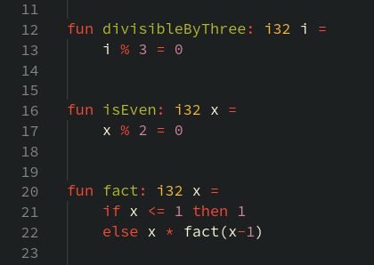

# vscode-ante

This plugin provides basic editor support for the programming language Ante.
This includes language server support through `ante-ls` provided it is installed separately.

## Features

- Syntax highlighting
- Language server suppport through `ante-ls`:
  - If `ante-ls` is not on your `$PATH`, set `ante.languageServerPath` in the plugin configuration to point at a non-`$PATH` binary
  - Diagnostics
  - Go-to Definition
  - Autocompletion
    - Auto-complete will suggest names that are out of scope as well. When selected, they will be imported automatically.
  - Actions:
    - Import the name under the cursor
    - Import an implicit to make the call under the cursor work (corresponds to the no-implicits-found compiler diagnostic which suggests an implicit to import)
