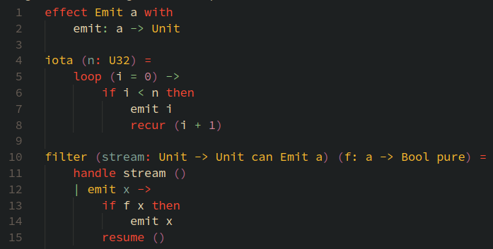

# vscode-ante

This plugin provides basic editor support for the programming language Ante.
This includes language server support through `ante-ls` provided it is installed separately.

## Features

- Syntax highlighting:
- Language server suppport through `ante-ls`
  - Set `ante.languageServerPath` in the plugin configuration to the path to `ante-ls`
